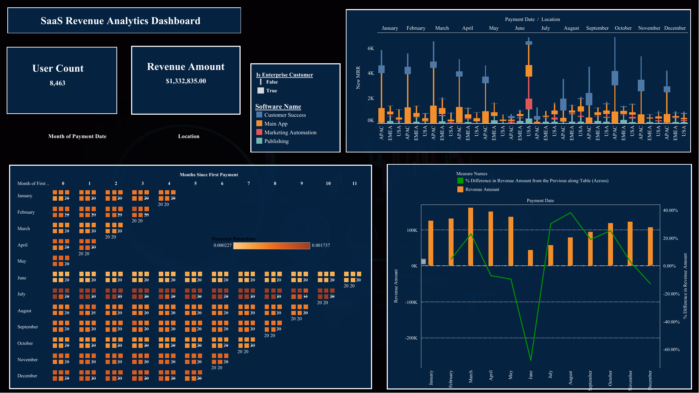

# SaaS Revenue Analytics Dashboard (Tableau)

## Project Overview

This advanced Tableau dashboard analyzes SaaS business performance by combining revenue metrics, user behavior, and cohort retention analysis.

It provides a multi-dimensional view of growth, monetization, and customer retention.

---

## Business Context

SaaS companies depend on both acquiring new users and retaining existing ones. Understanding revenue trends, cohort behavior, and growth dynamics is critical for sustainable success.

This dashboard answers key business questions such as:

* How is revenue evolving over time?
* What is the retention behavior of users after their first purchase?
* How does revenue growth fluctuate month over month?
* How do different regions contribute to revenue?

---

## Key Metrics

* Total Users
* Total Revenue
* Monthly Revenue
* Month-over-Month Growth (%)
* Revenue Retention

---

## Dashboard Components

### 1. KPI Overview

Displays total users and total revenue to provide a quick business snapshot.

### 2. Revenue Distribution by Region & Month

Shows how revenue varies across regions and over time.

### 3. Revenue Growth & MoM Change

Combines revenue trends with percentage change to highlight growth patterns and volatility.

### 4. Revenue Retention Cohort Analysis

Analyzes how revenue is retained across cohorts based on the month of first purchase.

This visualization helps understand:

* user retention behavior
* revenue decay patterns
* long-term customer value

---

## Tools Used

* Tableau
* Data Visualization
* Cohort Analysis
* Business Intelligence

---

## Key Insights

### Revenue Trends

* Revenue shows fluctuations with a significant drop followed by recovery, indicating possible external or seasonal effects
* Growth is inconsistent, suggesting volatility in user acquisition or monetization

### Growth Dynamics

* Month-over-month changes reveal sharp declines and strong rebounds
* Indicates sensitivity to campaigns, pricing, or product changes

### Retention Behavior

* Cohort analysis shows declining revenue over time, which is expected in SaaS models
* Some cohorts retain revenue better, indicating higher-quality user segments

### Regional Contribution

* Revenue distribution varies significantly across regions
* Certain regions dominate total revenue, highlighting key markets

### Strategic Implications

* Improving retention can significantly stabilize revenue
* Growth volatility suggests a need for more consistent acquisition strategies
* Cohort analysis can guide lifecycle marketing and retention campaigns

---

## Dashboard Preview

---

## Live Dashboard
[View Dashboard](https://public.tableau.com/app/profile/g.n.aydo.an/viz/GnAydogan-TableauHomework3-SaaSRevenueAnalysis/SaaSRevenueAnalyticsDashboard)

---

## Conclusion

This dashboard demonstrates how SaaS performance can be analyzed through revenue trends, growth metrics, and cohort retention.

It provides actionable insights for improving user retention, stabilizing growth, and optimizing business strategy.
